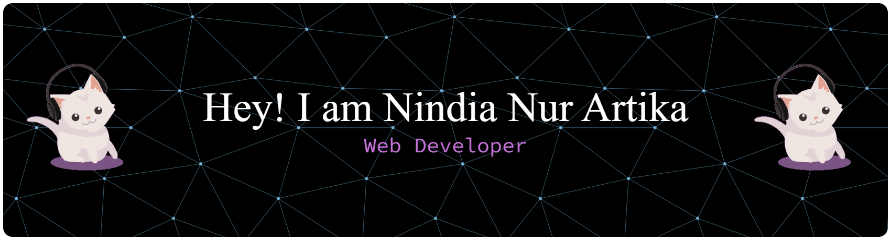

## Socials:

    

## Tech Stack:

                       

## GitHub Stats:

 
 

### Quote

---

## 💰 You can help me by Donating

---

###

<picture>
  <source media="(prefers-color-scheme: dark)" srcset="https://raw.githubusercontent.com/nrxtka/nrxtka/pacman-output/pacman-contribution-graph-dark.svg">
  <source media="(prefers-color-scheme: light)" srcset="https://raw.githubusercontent.com/nrxtka/nrxtka/pacman-output/pacman-contribution-graph.svg">
  
</picture>

###
